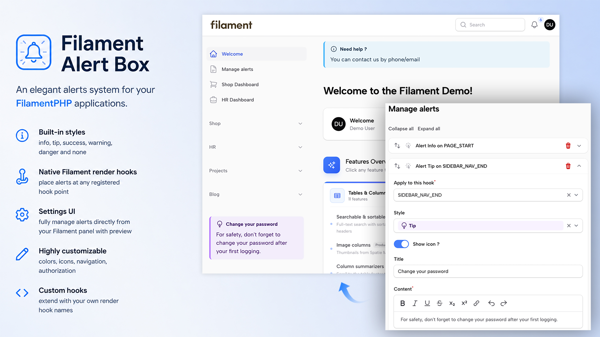

<a href="https://github.com/agencetwogether/filament-alert-box" class="filament-hidden">

</a>

<p align="center" class="flex items-center justify-center">
    <a href="https://filamentphp.com/docs/4.x/introduction/installation">
        
    </a>
    <a href="https://filamentphp.com/docs/5.x/introduction/installation">
        
    </a>
    <a href="https://packagist.org/packages/agencetwogether/filament-alert-box">
        
    </a>
    <a href="https://packagist.org/packages/agencetwogether/filament-alert-box/actions?query=workflow%3A"Check+%26+fix+styling"+branch%3Amain" class="filament-hidden">
        
    </a>
    <a href="https://packagist.org/packages/agencetwogether/filament-alert-box">
        
    </a>
<p>

# Filament Alert Box

A [FilamentPHP](https://filamentphp.com) plugin to define and display contextual alerts anywhere on your admin panel
pages — Resources, custom Pages — using Filament's native render hooks system.

Alerts are managed through a dedicated settings page in your panel and stored in the database via [
`spatie/laravel-settings`](https://github.com/spatie/laravel-settings). No code changes needed after initial setup.

---

## Features

- **3 alert scopes** — Resource, Page, Global
- **6 built-in styles** — `info`, `tip`, `success`, `warning`, `danger`, `none`
- **Native Filament render hooks** — place alerts at any registered hook point
- **Settings UI** — fully manage alerts directly from your Filament panel
- **Live preview** — see the alert render in real-time while editing
- **Rich text content** — editor with bold, italic, links, and more
- **Multilingual** — English and French included, fully translatable
- **Highly customizable** — colors, icons, navigation, authorization
- **Custom hooks** — extend with your own render hook names
- **Shield Support** — Built-in permission setup for Filament Shield

---

## Requirements

- PHP `^8.2`
- FilamentPHP `^4.0 | ^5.0`

AlertBox uses [`spatie/laravel-settings`](https://github.com/spatie/laravel-settings) to store plugin settings. It's pulled in automatically as a Composer dependency — filament-alert-box:install publishes and runs its migration if you don't already have a settings table.

---

## Installation

**Install the package via Composer:**

```bash
composer require agencetwogether/filament-alert-box
```
> [!IMPORTANT]
> If you have not set up a custom theme and are using Filament Panels follow the instructions in
> the [Filament Docs (V4)](https://filamentphp.com/docs/4.x/styling/overview#creating-a-custom-theme), [Filament Docs (V5)](https://filamentphp.com/docs/5.x/styling/overview#creating-a-custom-theme)
> first.

### Automatic installation

**Run install command:**

```bash
php artisan filament-alert-box:install
```

The installer will interactively guide you through:

- Publishing and running the database migrations (creates the `settings` table if needed)
- Seeding demo alerts
- Publishing the configuration file
- Publishing translations for customization
- Publishing views for customization
- Register the plugin in your Filament panel
- Register AlertBox styles in your custom Filament theme
- Configure [Filament Shield](#filament-shield-integration) permission

Then rebuild your assets:

```bash
npm run build
```

### Manual installation

Publish and run the migrations with:

```bash
php artisan vendor:publish --tag="filament-alert-box-migrations"
php artisan migrate
```

You can seed demo alerts using

```bash
php artisan db:seed --class=Agencetwogether\\AlertBox\\Database\\Seeders\\AlertBoxSeeder
```

You can publish the config file with:

```bash
php artisan vendor:publish --tag="filament-alert-box-config"
```

You can publish the translations using

```bash
php artisan vendor:publish --tag="filament-alert-box-translations"
```

You can publish the views using

```bash
php artisan vendor:publish --tag="filament-alert-box-views"
```

**Register the plugin in your Filament panel provider:**

```php
use Agencetwogether\AlertBox\AlertBoxPlugin;

public function panel(Panel $panel): Panel
{
    return $panel
        ->plugins([
            AlertBoxPlugin::make(),
        ]);
}
```

**Add the views to your theme.css**

After setting up a custom theme add the following to your theme CSS file.

```css
@source '../../../../vendor/agencetwogether/filament-alert-box/resources/views/**/*';
```

Then rebuild your assets:

```bash
npm run build
```
---

## Usage

Once installed, a **"Manage alerts"** page is added to your panel's navigation. From this page you can create and manage all your alerts without touching any code.

Each alert is defined as a **block** with one of three scopes:

### 🗂 Resource

Displays an alert on one or more pages of a specific Resource.

- Select the **Resource** to target
- Optionally enable **scope constraint** to restrict to specific resource pages (Index, Create, Edit, View, etc.)
- Choose the **hook** where the alert should appear

### 📄 Page

Displays an alert on a specific custom Page registered in your panel.

- Select the **Page** to target
- Choose the **hook** where the alert should appear

### 🌐 Global

Displays an alert globally on all pages matching the selected hook.

- Choose the **hook** where the alert should appear
- Supports **custom hooks** defined in your configuration

---

## Alert Configuration

Each alert block, regardless of scope, shares a common set of fields:

| Field         | Description                                                         |
|---------------|---------------------------------------------------------------------|
| **Hook**      | The Filament render hook where the alert is injected                |
| **Style**     | Visual style: `info`, `tip`, `success`, `warning`, `danger`, `none` |
| **Show icon** | Whether to display the icon next to the title                       |
| **Title**     | The alert's title                                                   |
| **Content**   | Rich text content (bold, italic, underline, links, etc.)            |
| **Preview**   | Live visual preview of the alert                                    |

---

## Available Render Hooks

The plugin exposes a curated list of Filament render hooks for each scope.

### Resource hooks

| Hook                                                         | Position                     |
|--------------------------------------------------------------|------------------------------|
| `panels::page.start`                                         | Top of the page              |
| `panels::page.end`                                           | Bottom of the page           |
| `panels::page.header-widgets.before`                         | Before header widgets        |
| `panels::page.header-widgets.after`                          | After header widgets         |
| `panels::page.footer-widgets.before`                         | Before footer widgets        |
| `panels::page.footer-widgets.after`                          | After footer widgets         |
| `panels::resource.pages.list-records.table.before`           | Before the list table        |
| `panels::resource.pages.list-records.table.after`            | After the list table         |
| `panels::resource.pages.manage-related-records.table.before` | Before related records table |
| `panels::resource.pages.manage-related-records.table.after`  | After related records table  |
| `panels::resource.relation-manager.before`                   | Before a relation manager    |
| `panels::resource.relation-manager.after`                    | After a relation manager     |

### Page hooks

| Hook                                               | Position                    |
|----------------------------------------------------|-----------------------------|
| `panels::page.start` / `panels::page.end`          | Top / bottom of page        |
| `panels::content.start` / `panels::content.end`    | Start / end of content area |
| `panels::content.before` / `panels::content.after` | Before / after content      |
| `panels::page.header-widgets.before` / `.after`    | Around header widgets       |
| `panels::page.header.heading.before` / `.after`    | Around the page heading     |
| `panels::topbar.before` / `panels::topbar.after`   | Around the top bar          |
| `panels::footer`                                   | Footer area                 |
| `panels::simple-layout.start` / `.end`             | Simple layout bounds        |
| `panels::simple-page.start` / `.end`               | Simple page bounds          |

### Global hooks

All Page hooks above, plus:

| Hook                                                         | Position                           |
|--------------------------------------------------------------|------------------------------------|
| `panels::auth.login.form.before` / `.after`                  | Around the login form              |
| `panels::auth.register.form.before` / `.after`               | Around the register form           |
| `panels::auth.password-reset.request.form.before` / `.after` | Around password reset request form |
| `panels::auth.password-reset.reset.form.before` / `.after`   | Around the reset form              |
| `panels::sidebar.start` / `panels::sidebar.footer`           | Sidebar areas                      |
| `panels::sidebar.nav.start` / `panels::sidebar.nav.end`      | Around sidebar navigation          |
| `panels::tenant-menu.before` / `.after`                      | Around the tenant menu             |
| `panels::user-menu.profile.before` / `.after`                | Around the user profile menu       |

---

## Plugin Customization

All options are chainable on `AlertBoxPlugin::make()`.

### Navigation

```php
AlertBoxPlugin::make()
    ->navigationLabel('Alerts')
    ->navigationIcon('heroicon-o-bell-alert')
    ->navigationGroup('Settings')
    ->navigationSort(5)
    ->title('Alert Management'),
```

### Page Access Control

The `ManageAlertBox` settings page follows a **three-level priority chain** to decide whether the current user is allowed to access it. Each level is evaluated in order; the first one that applies wins.

#### Priority 1 — Filament Shield permission *(highest)*

If Shield is installed in your project **and** you have generated the permissions for this page, access is controlled exclusively by the generated permission e.g. `View:ManageAlertBox`.

The page will be visible only to users (or roles) that have been granted that permission in your Shield configuration. The `->authorize()` option described below is ignored in this case.

> [!NOTE]
> If Shield is installed, but you have **not yet run** `shield:generate`, this level is skipped and the chain falls through to the next one. The page will not silently disappear while you are setting things up.

---

#### Priority 2 — Custom `->authorize()` closure

If Shield is not installed (or its permission has not been generated yet), you can restrict access with your own logic by passing a closure to the `->authorize()` method when registering the plugin in your panel provider:

```php
AlertBoxPlugin::make()
    ->authorize(fn (): bool => auth()->user()->isAdmin()),
```

The closure receives no arguments and must return a `bool`. It is evaluated on every request, so you can use any runtime check — roles, model attributes, feature flags, etc.:

```php
AlertBoxPlugin::make()
    ->authorize(fn (): bool => auth()->user()->hasRole('editor')),
```

> [!NOTE]
> This level is only reached when Shield is **not** managing access for this page. If Shield is active and the permission exists, this closure is never called.

---

#### Priority 3 — Open access *(default)*

If neither of the above applies — Shield is not installed and `->authorize()` was never called — the page is accessible to **every authenticated user who has access to the panel**. This is the default behavior and requires no configuration.

---

#### Summary

| Situation                                      | Who can access the page                   |
|------------------------------------------------|-------------------------------------------|
| Shield installed + permission generated        | Users/roles granted `View:ManageAlertBox` |
| Shield installed, permission **not** generated | Falls through to the next rule            |
| `->authorize(fn ...)` defined, no Shield       | Users for whom the closure returns `true` |
| Neither Shield nor `->authorize()`             | All authenticated panel users             |

---

### Colors

Override the default Tailwind colors for each alert style:

```php
AlertBoxPlugin::make()
    ->colorInfo('blue')
    ->colorTip('violet')
    ->colorSuccess('emerald')
    ->colorWarning('amber')
    ->colorDanger('rose'),
```

### Builder UI

```php
AlertBoxPlugin::make()
    ->blocksCollapsible()       // Allow collapsing alert blocks
    ->blocksCollapsed()         // Collapse all blocks by default (implies collapsible)
    ->iconResource('heroicon-o-table-cells')
    ->iconPage('heroicon-o-document')
    ->iconGlobal('heroicon-o-globe-alt')
    ->addActionAlignment(\Filament\Support\Enums\Alignment::Center),
```

---

## Configuration

After publishing the config file, you can customize:

```php
// config/filament-alert-box.php

return [
    'page' => [
        'slug'    => 'alert-box',   // URL slug for the settings page
        'cluster' => null,          // Optional cluster class
    ],

    'toolbar_buttons' => [
        ['bold', 'italic', 'underline', 'strike', 'subscript', 'superscript', 'link'],
        ['undo', 'redo'],
    ],

    'default_icons' => [
        'info'    => Heroicon::OutlinedInformationCircle,
        'tip'     => Heroicon::OutlinedLightBulb,
        'success' => Heroicon::OutlinedCheckCircle,
        'warning' => Heroicon::OutlinedExclamationTriangle,
        'danger'  => Heroicon::OutlinedFire,
        'none'    => null,
    ],

    'default_colors' => [
        'info'    => 'sky',
        'tip'     => 'purple',
        'success' => 'green',
        'warning' => 'yellow',
        'danger'  => 'red',
        'none'    => null,
    ],

    // Add your own Filament render hooks here
    // See: https://filamentphp.com/docs/5.x/advanced/render-hooks
    'custom_hooks' => [
        // 'panels::my-custom-hook',
    ],
];
```

---

## Translations

The plugin ships with English and French translations. To customize them:

```bash
php artisan vendor:publish --tag=filament-alert-box-translations
```

Files will be published to `lang/vendor/filament-alert-box/`.

---

## Views

To customize the alert blade template:

```bash
php artisan vendor:publish --tag=filament-alert-box-views
```

Files will be published to `resources/views/vendor/filament-alert-box/`.

---
## Filament Shield Integration

The plugin ships with built-in support for [Filament Shield](https://github.com/bezhanSalleh/filament-shield). Shield is entirely optional — without it, **"Manage alerts"** page is accessible to any authenticated user unless you set explicitly [`authorize()`](#page-access-control) method when you register the plugin.

### Automatic setup

If Shield is installed, the `filament-alert-box:install` command will generate permission entries via `shield:generate`

### Manual setup

If you prefer to set up Shield manually, or if the automatic setup didn't complete:

```bash
php artisan shield:generate --panel=admin --option=permissions
```

### Supported permissions

**Manage alerts** page has its own page-level permission managed by Shield.

---

## Suggested Companion Plugin

[**agencetwogether/hookshelper**](https://github.com/agencetwogether/hookshelper) — A simple Filament plugin to toggle a
visual overlay of all available render hooks on the current page. Very useful when configuring alert positions.

---

## Changelog

Please see [CHANGELOG](CHANGELOG.md) for more information on what has changed recently.

---

## Contributing

Please see [CONTRIBUTING](.github/CONTRIBUTING.md) for details.

---

## Security Vulnerabilities

Please review [our security policy](.github/SECURITY.md) on how to report security vulnerabilities.

---

## Credits

- [Max](https://github.com/agencetwogether)
- [All Contributors](../../contributors)

---

## License

This package is open-sourced software licensed under the [MIT license](LICENSE.md).
